# Mobify

A new Flutter project.

## Getting Started

This project is a starting point for a Flutter application.

### Splash Screen

  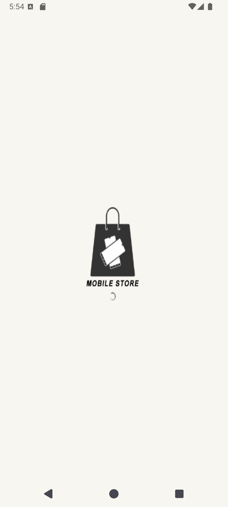

### Onboarding Screens

  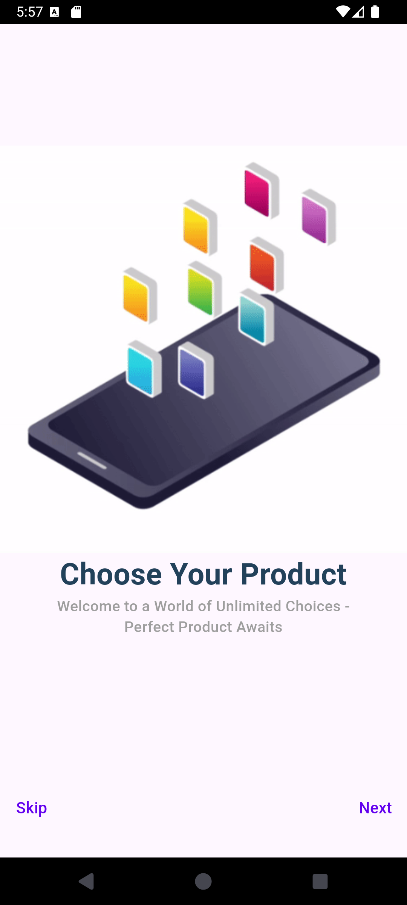
  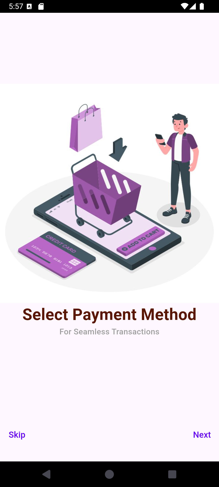
  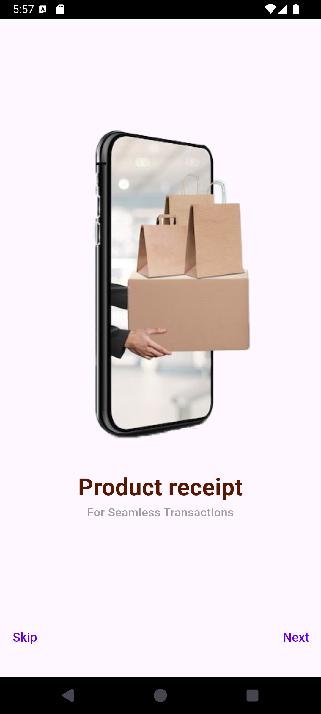

### Authentication Screens

  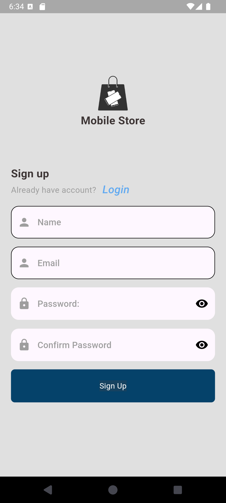
  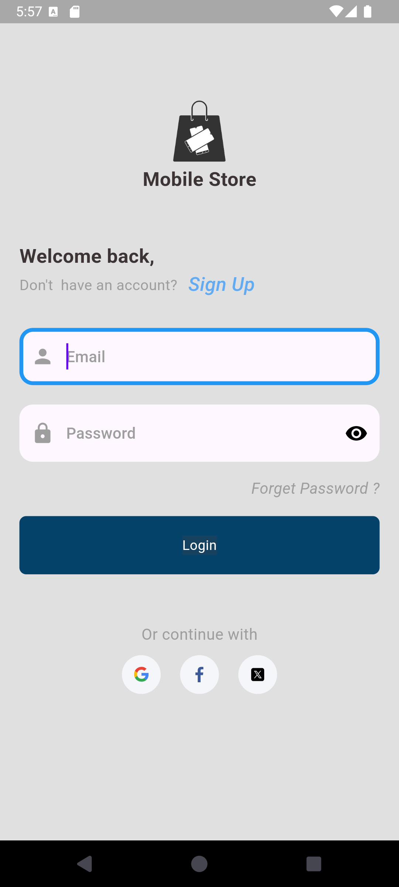
  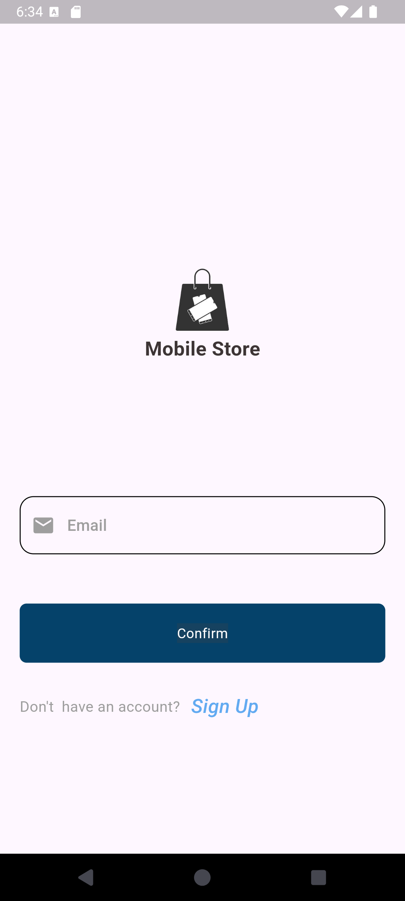
  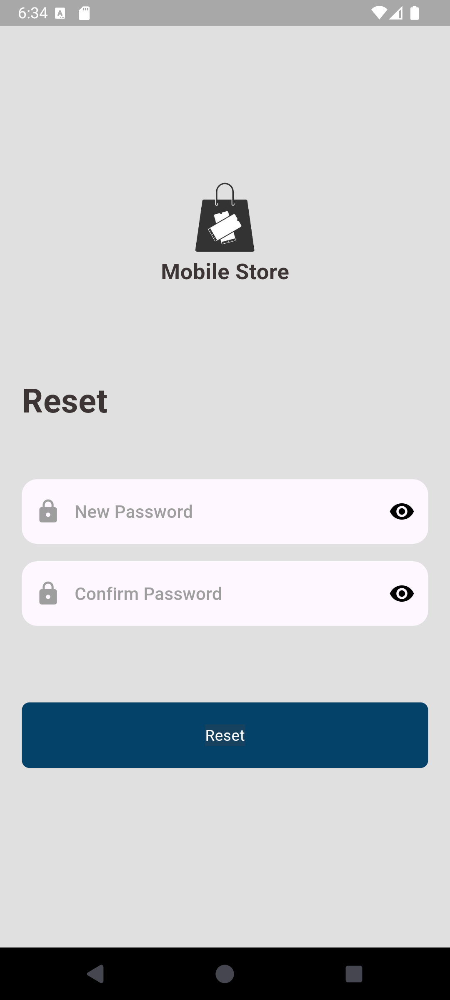
  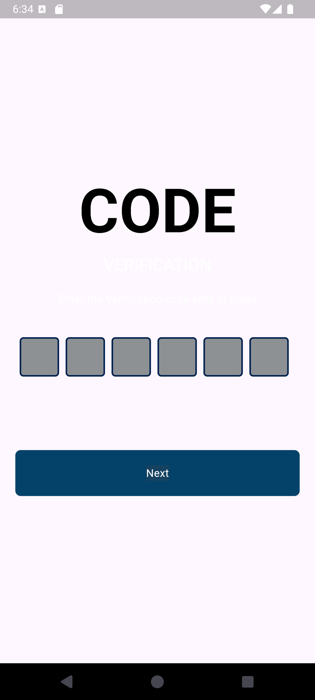

### Home Screens

  
  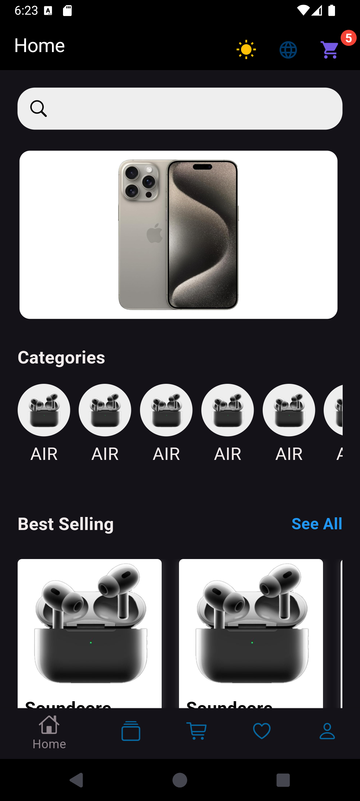

### Favorite Screens

  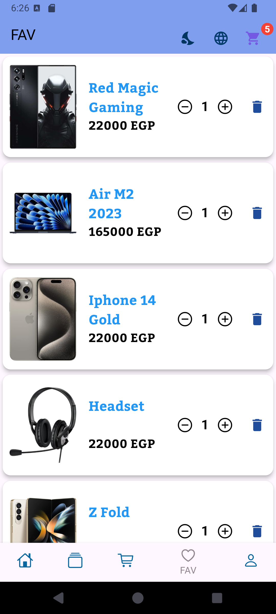
  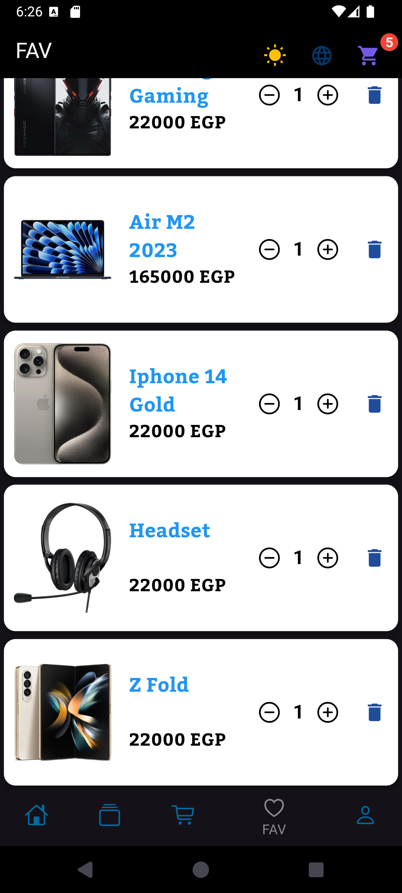

### Cart Screens

  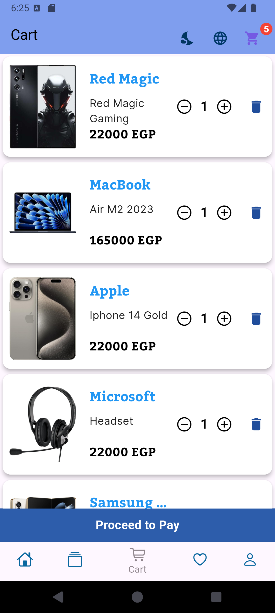
  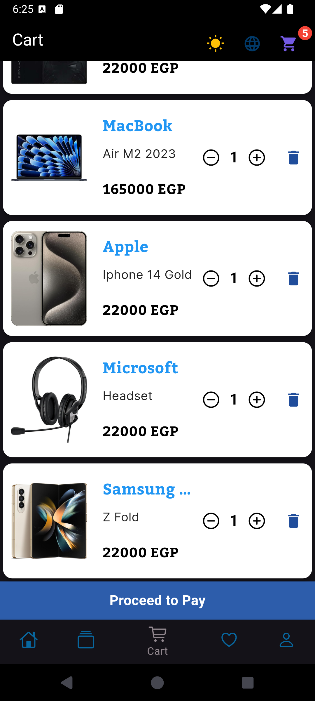
  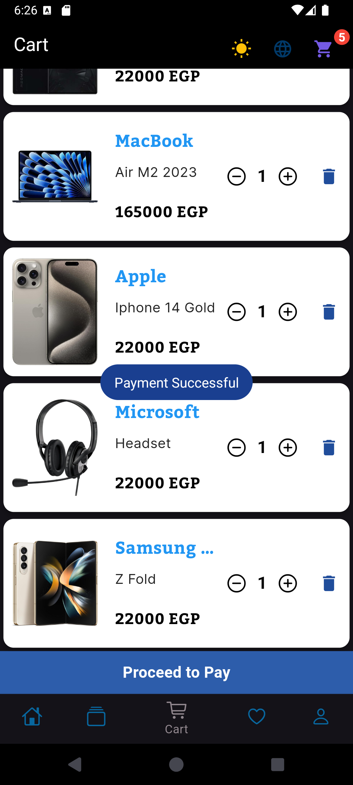

### Profile Screens

  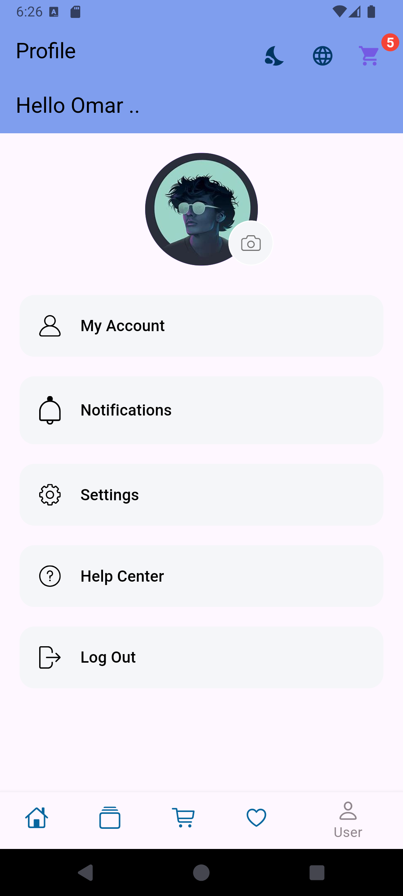
  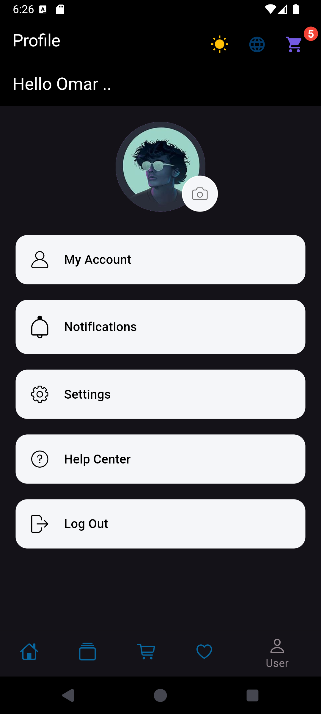

### Product Screens

  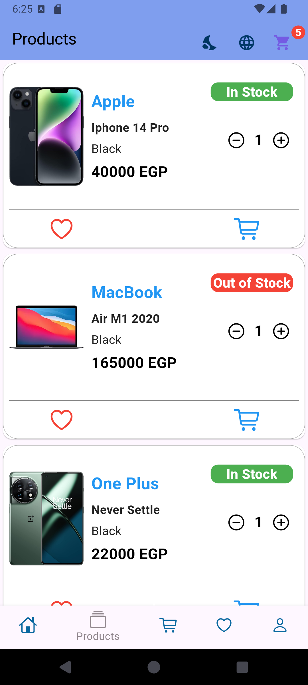
  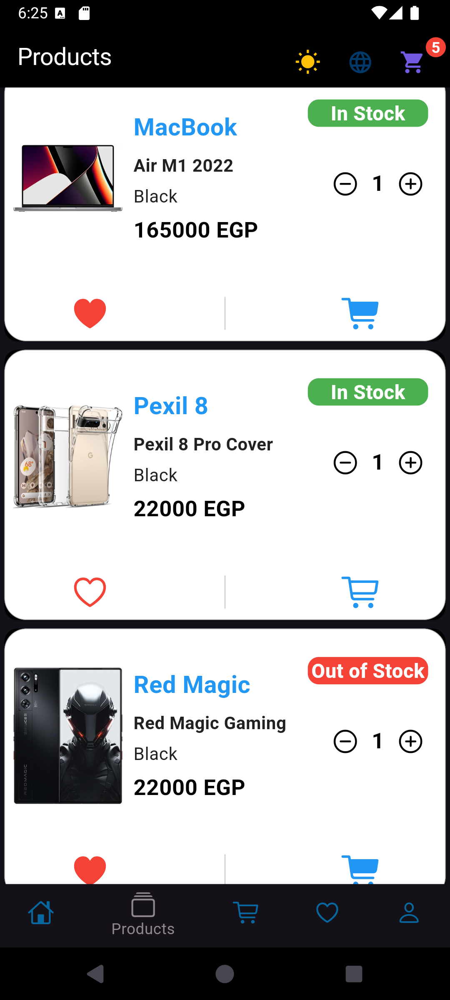

A few resources to get you started if this is your first Flutter project:

- [Lab: Write your first Flutter app](https://docs.flutter.dev/get-started/codelab)
- [Cookbook: Useful Flutter samples](https://docs.flutter.dev/cookbook)

For help getting started with Flutter development, view the
[online documentation](https://docs.flutter.dev/), which offers tutorials,
samples, guidance on mobile development, and a full API reference.
